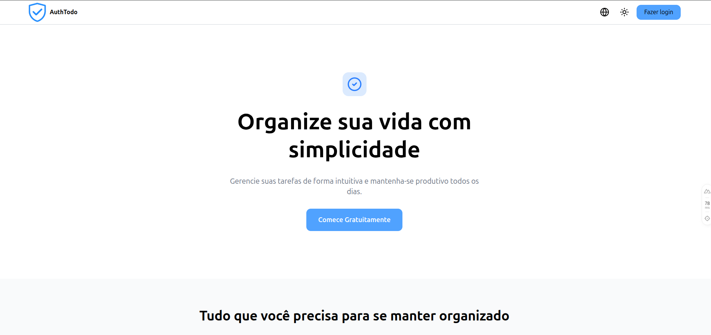
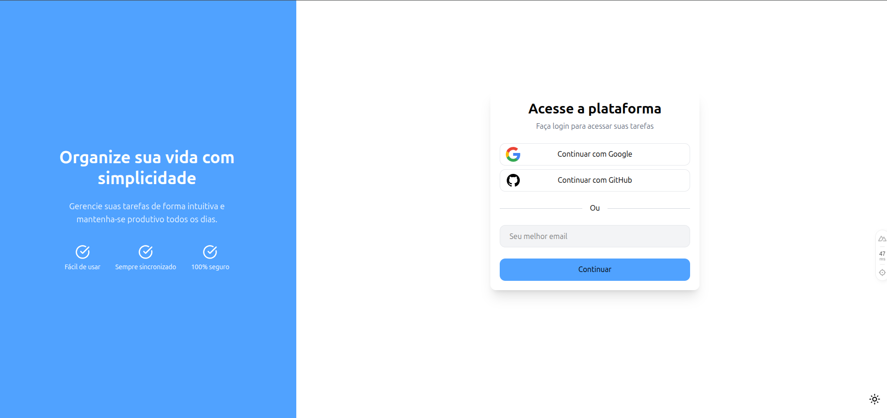
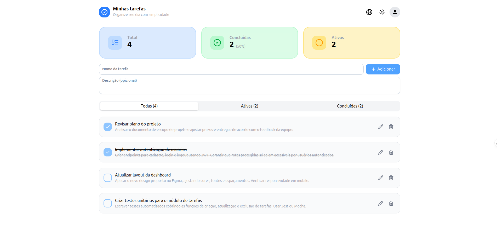
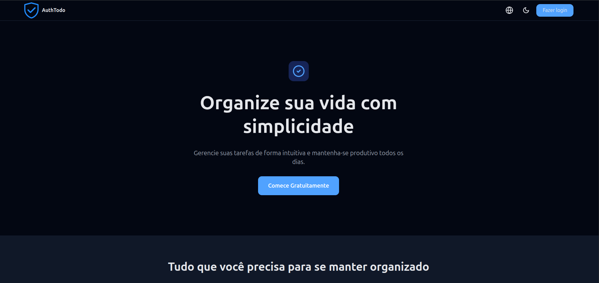
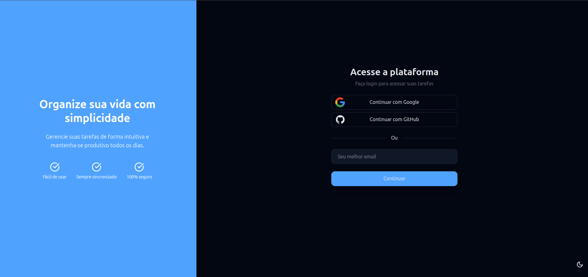
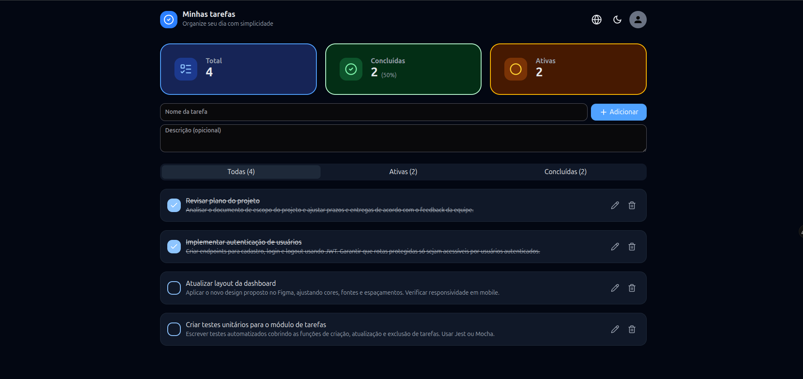

# AuthTodo Frontend

<div align="center">


[](https://opensource.org/licenses/MIT)

</div>

### **Aplicação web moderna para gerenciamento de tarefas com autenticação segura e interface intuitiva**
*Desenvolvida com Nuxt 4, Vue 3 e TypeScript*

<br>

> 🔗 **Backend**: [authtodo-backend](https://github.com/viniciusrvcruz/authtodo-backend)

## 🎯 Sobre o Projeto

**AuthTodo** é uma aplicação de gerenciamento de tarefas (To-Do List) desenvolvida com Nuxt 4, focada em oferecer uma experiência moderna, responsiva e segura. O projeto implementa autenticação baseada em cookies com suporte a múltiplos provedores (Google, GitHub e OTP por email).

### Objetivos

- Proporcionar uma interface intuitiva para gerenciamento de tarefas
- Implementar autenticação segura com múltiplas opções de login
- Oferecer suporte a temas claro/escuro
- Disponibilizar a aplicação em múltiplos idiomas
- Garantir responsividade em todos os dispositivos

## 📸 Screenshots

### Tema Claro
  

### Tema Escuro
  


## 🚀 Tecnologias Utilizadas

| Categoria | Tecnologias |
|-----------|-------------|
| **Core** | [Nuxt 4](https://nuxt.com/) • [Vue 3](https://vuejs.org/) • [TypeScript](https://www.typescriptlang.org/) |
| **Estilização** | [Tailwind CSS](https://tailwindcss.com/) • [PrimeVue](https://primevue.org/) |
| **Estado** | [Pinia](https://pinia.vuejs.org/) • [@pinia/nuxt](https://pinia.vuejs.org/ssr/nuxt.html) |
| **Autenticação** | [nuxt-auth-sanctum](https://github.com/manchenkoff/nuxt-auth-sanctum) |
| **Validação** | [Vee-Validate](https://vee-validate.logaretm.com/) • [Zod](https://zod.dev/) |
| **i18n** | [@nuxtjs/i18n](https://i18n.nuxtjs.org/) |
| **Outros** | [@nuxtjs/color-mode](https://color-mode.nuxtjs.org/) • [@nuxt/icon](https://nuxt.com/modules/icon) |

## 📁 Estrutura do Projeto

```
authtodo-frontend/
├── app/
│   ├── assets/              # Recursos estáticos (CSS, temas)
│   │   ├── css/            # Estilos globais
│   │   └── theme/          # Configuração de temas PrimeVue
│   ├── components/          # Componentes Vue reutilizáveis
│   │   ├── auth/           # Componentes de autenticação
│   │   ├── home/           # Componentes da página home
│   │   ├── landing/        # Componentes da landing page
│   │   ├── modal/          # Componentes de modais
│   │   └── task/           # Componentes relacionados a tarefas
│   ├── composables/         # Composables Vue (lógica reutilizável)
│   │   ├── services/       # Serviços de API
│   │   └── useAlert.ts     # Composable para alertas/toasts
│   ├── layouts/             # Layouts da aplicação
│   ├── pages/               # Páginas da aplicação (roteamento automático)
│   │   ├── home/           # Página principal (tarefas)
│   │   ├── login/          # Página de login
│   │   └── index.vue       # Landing page
│   ├── plugins/             # Plugins Nuxt
│   ├── stores/              # Stores Pinia
│   │   └── taskStore.ts    # Store de gerenciamento de tarefas
│   ├── types/               # Definições de tipos TypeScript
│   │   ├── enums/          # Enumerações
│   │   ├── schemas/        # Schemas Zod para validação
│   │   └── *.type.ts       # Tipos derivados dos schemas
│   ├── utils/               # Funções utilitárias
│   └── app.vue              # Componente raiz da aplicação
├── i18n/
│   └── locales/             # Arquivos de tradução
│       ├── pt-br.json      # Português (Brasil)
│       └── en.json         # Inglês
├── public/                  # Arquivos públicos estáticos
├── .env.example             # Exemplo de variáveis de ambiente
├── docker-compose.yml       # Configuração Docker
├── nuxt.config.ts           # Configuração do Nuxt
├── package.json             # Dependências e scripts
└── tsconfig.json            # Configuração TypeScript
```

### Descrição dos Diretórios Principais

#### `/app/components`
Componentes Vue organizados por contexto:
- **auth/**: Formulários e steps de autenticação (email, OTP)
- **task/**: CRUD de tarefas, filtros, estatísticas
- **home/**: Header, menu de usuário
- **modal/**: Modais reutilizáveis

#### `/app/composables/services`
Camada de serviços que encapsula chamadas à API:
- `useApiService.ts`: Cliente HTTP base
- `useAuthService.ts`: Autenticação (OTP, OAuth)
- `useTaskService.ts`: CRUD de tarefas
- `useUserService.ts`: Operações de usuário

#### `/app/stores`
Gerenciamento de estado global com Pinia:
- `taskStore.ts`: Estado das tarefas, filtros e contadores

#### `/app/types`
Sistema de tipos robusto:
- **schemas/**: Validação com Zod
- **enums/**: Enumerações TypeScript
- **types/**: Tipos inferidos dos schemas

## 📋 Pré-requisitos

- **Node.js**: >= 18.x
- **npm**: >= 9.x (ou yarn/pnpm/bun)
- **Docker** (opcional): Para execução em container

## 🔧 Instalação

### 1. Clone o repositório

```bash
git clone https://github.com/viniciusrvcruz/authtodo-frontend.git
cd authtodo-frontend
```

### 2. Instale as dependências

```bash
npm install
```

## ⚙️ Configuração

### Variáveis de Ambiente

Crie um arquivo `.env` na raiz do projeto baseado no `.env.example`:

```bash
cp .env.example .env
```

Configure as seguintes variáveis:

```env
# URL da API (acessível pelo navegador)
NUXT_PUBLIC_API_BASE_URL=http://localhost:8000

# URL da API (acessível pelo container Docker - SSR)
CONTAINER_API_BASE_URL=http://authtodo_api

# Nome do projeto Docker Compose
COMPOSE_PROJECT_NAME=authtodo
```

#### Explicação das Variáveis

- **NUXT_PUBLIC_API_BASE_URL**: URL da API backend acessível pelo navegador (client-side)
- **CONTAINER_API_BASE_URL**: URL interna para comunicação entre containers Docker (server-side rendering)
- **COMPOSE_PROJECT_NAME**: Prefixo para recursos Docker Compose

## 🎮 Como Usar

### Desenvolvimento Local

Inicie o servidor de desenvolvimento:

```bash
npm run dev
```

A aplicação estará disponível em `http://localhost:3000`

## ✨ Funcionalidades

### Autenticação

- **OAuth Social**: Login com Google e GitHub
- **OTP por Email**: Autenticação passwordless via código de verificação
- **Sessão Persistente**: Gerenciada via cookies HTTP-only

### Gerenciamento de Tarefas

- ✅ Criar tarefas com nome e descrição
- ✏️ Editar tarefas existentes
- 🗑️ Deletar tarefas
- ☑️ Marcar como concluída/ativa
- 🔍 Filtrar por status (todas, ativas, concluídas)
- 📊 Visualizar estatísticas (total, concluídas, ativas)

### Interface

- 🌓 **Tema Claro/Escuro**: Alternância automática ou manual
- 🌍 **Multilíngue**: Suporte a Português (BR) e Inglês
- 📱 **Responsivo**: Design adaptável para mobile, tablet e desktop
- ♿ **Acessível**: Componentes seguindo boas práticas de acessibilidade

## 🏗️ Arquitetura e Padrões

### Padrões Adotados

#### 1. **Composition API**
Utilização da Composition API do Vue 3 para melhor organização e reutilização de lógica.

#### 2. **Service Layer Pattern**
Separação da lógica de API em serviços reutilizáveis.

#### 3. **Schema-First Validation**
Validação de dados com Zod, garantindo type-safety.

#### 4. **State Management com Pinia**
Gerenciamento de estado global centralizado e tipado.

#### 5. **Auto-import**
Componentes, composables e utilitários são importados automaticamente pelo Nuxt.

### Convenções de Código

- **Nomenclatura**: camelCase para variáveis/funções, PascalCase para componentes
- **Componentes**: Um componente por arquivo, nome descritivo
- **Tipos**: Definidos em `/types` com schemas Zod
- **Serviços**: Prefixo `use` para composables
- **Stores**: Sufixo `Store` para stores Pinia

## 🌍 Internacionalização

O projeto suporta múltiplos idiomas através do módulo `@nuxtjs/i18n`.

### Idiomas Disponíveis

- 🇧🇷 Português (Brasil) - `pt-br`
- 🇺🇸 Inglês - `en`

## 🐳 Docker

### Executar com Docker Compose

```bash
docker-compose up -d
```

A aplicação estará disponível em `http://localhost:3000`

### Parar os Containers

```bash
docker-compose down
```

## 🤝 Contribuindo

Contribuições são bem-vindas! Para contribuir:

1. Fork o projeto
2. Crie uma branch para sua feature (`git checkout -b feature/my-feature`)
3. Commit suas mudanças (`git commit -m 'feat: add my feature'`)
4. Push para a branch (`git push origin feature/my-feature`)
5. Abra um Pull Request

## 📄 Licença

Este projeto está sob a licença MIT. Veja o arquivo `LICENSE` para mais detalhes.

---

**Desenvolvido com ❤️ por Vinicius Cruz**
